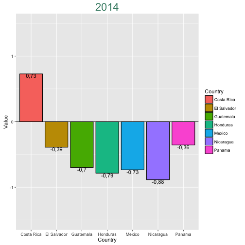

<style>
    .reveal code {
        font-size: 0.6em;
    }
    
    /* slide titles */
    .reveal h3 { 
        color: blue;
    }
    
.reveal p, .reveal ul, .reveal ol {
	font-size: 28px;
}

.reveal img {
	margin: 30px 0 0 0;
	border: 4px solid #eee;
    width: 80%;
    height: 400px;
}

</style>

## World Governance Index
### Gustavo Lobo Aguilar, 2016

---

## Definition of Governance

The traditions and institutions by which authority in a country is exercised. This includes a) the process by which governments are selected, monitored and replaced; b) the capacity of the government to effectively formulate and implement sound policies; and c) the respect of citizens and the state for the institutions that govern economic and social interactions among them.

---

## Statistical Metodology: Unobserved Components Model

1. Step 1: Standarize data from diverse sources into comparable units.All the individual variables have been rescaled to run from zero to one, with higher values indicating better outcomes.

2. Step 2: Construct an aggregate indicator of governance as a weighted average of the underlying source variables. The units of aggregate governance indicators have zero mean, unit standard deviation, and ranging approximately from -2.5 to 2.5.

3. Step 3: Construct margins of error that reflect the unavoidable imprecision in measuring governance.

---

## About the dataset

- Six composite indicators of broad dimensions of governance covering over 200 countries since 1996.
- Based on several hundred variables obtained from 31 different data sources (www.govindicators.org).
- Draw together data on perceptions of governance.
- 21 variables, 1-5 factors to identify the indicator type and the country, 6-21 data from years 1996 to 2014.


```r
    str(wgi.df)
```

```
## 'data.frame':	7740 obs. of  21 variables:
##  $ Country.Name  : Factor w/ 215 levels "Afghanistan",..: 1 1 1 1 1 1 1 1 1 1 ...
##  $ Country.Code  : Factor w/ 215 levels "ABW","ADO","AFG",..: 3 3 3 3 3 3 3 3 3 3 ...
##  $ Indicator.Type: chr  "Control of Corruption" "Control of Corruption" "Control of Corruption" "Control of Corruption" ...
##  $ Indicator.Name: chr  " Estimate" " Number of Sources" " Percentile Rank" " Percentile Rank, Lower Bound of 90% Confidence Interval" ...
##  $ Indicator.Code: Factor w/ 36 levels "CC.EST","CC.NO.SRC",..: 1 2 3 4 5 6 7 8 9 10 ...
##  $ Y1996         : num  -1,847 1 0,488 0 17,476 ...
##  $ Y1998         : num  -1,836 1 0,488 0 14,078 ...
##  $ Y2000         : num  -1,91 1 0 0 7,77 ...
##  $ Y2002         : num  -1,426 1 0,488 0 34,466 ...
##  $ Y2003         : num  -1,55 2 1,95 0 11,17 ...
##  $ Y2004         : num  -1,42 4 3,9 0 13,11 ...
##  $ Y2005         : num  -1,46 4 1,46 0 13,59 ...
##  $ Y2006         : num  -1,445 6 3,415 0,485 10,68 ...
##  $ Y2007         : num  -1,591 5 0,971 0 8,696 ...
##  $ Y2008         : num  -1,637 6 0,971 0 5,797 ...
##  $ Y2009         : num  -1,513 7 0,957 0 9,524 ...
##  $ Y2010         : num  -1,624 8 0,952 0 5,213 ...
##  $ Y2011         : num  -1,55 8 1,42 0 7,55 ...
##  $ Y2012         : num  -1,41 9 1,91 0 12,86 ...
##  $ Y2013         : num  -1,43 10 1,91 0 11,43 ...
##  $ Y2014         : num  -1,331 10 6,25 0,957 13,876 ...
```

---

## Example of a plot

This is an example plot based on the dataset. It compares the "Control of Corruption" dimension of governance. Users will be able to select other 5 indicators, years from 1996 to 2014, any of the countries included in the origianal dataset, and also plot a trend of a given year range, country (among the previously compared) and indicator type. 


